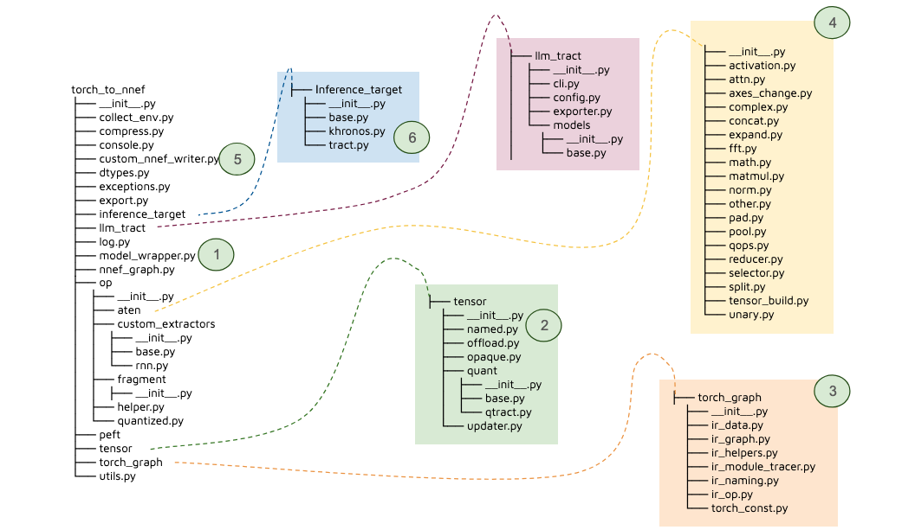

# :gear: Internal design

Internals of torch to NNEF export
is mostly segmented in 6 steps as shown bellow:

<figure markdown="span">
    
    <figcaption>figure 1: Export internal process</figcaption>
</figure>

Each of those steps have specific aims and goals.

1. Aims to make sense of complex inputs and outputs such as dict, dict like object containing tensors or tensors inside containers in containers...
2. Name each tensor after the module it is assigned to (if it's shared across multiple modules first name encountered will be retained)
3. Trace the PyTorch Graph module by module starting from the provided model each sub-module call is solved after this module have been traced. each submodule is colapsed inside it's parent. This tracing build a specific internal representation (IR) in torch to nnef which is NOT torch graph but a simplified version of it that is no more tied to torch cpp internals and with removed useless operators for inference.
4. Translate the torch to nnef internal IR into NNEF depending on inference target selected
5. Save each tensor on disk in .dat and serialize the graph.nnef and graph.quant associated.

<figure markdown="span">
    
    <figcaption>figure 2: code structure as of 2025-08 (n° correspond to figure 1)</figcaption>
</figure>

!!! note
    These steps only apply to `torch_to_nnef.export_model_to_nnef` export function that export the graph + the tensors.
    To observe those in practice setting log level to info and not filtering this lib logs is helpful a proposed default logger is available in `torch_to_nnef.log.init_log`

## 1. Auto wrapper

The auto wrapper is available at [`torch_to_nnef.model_wrapper`](/reference/torch_to_nnef/model_wrapper). In essence,
this step try hard to make sense of the input and output provided by the
user as input parameters by 'flattening' and extracting from complex data-structures a proper
list of tensor to be passed. Some example can be seen in [our multi inputs/outputs tutorial](/tutos/3_multi_inputs_outputs/).
Still note that as of today the graph is traced statically with Python primitive constantized.
Also raw object passed in `forward` function are not supported yet (we have a uncertainty about the order in which tensors found in it should be passed).

## 2. Tensor naming

This replace each tensor in the graph (code can be found in [`torch_to_nnef.tensor.named`](/reference/torch_to_nnef/tensor/named))
by a named tensor holding the name it will have in the different intermediate representations.
This is helpful to keep consistent tensor naming between the PyTorch parameters/buffers name
and NNEF archive we build. Allowing confident reference between the 2 worlds. In practice this
tensor act just like a classical `torch.Tensor` so it can even be used beyond `torch_to_nnef` usecase,
if you want to name tensors.

## 3. Internal IR representation

While tracing the graph recursively you may debug it's parsed representation as follows:
let's imagine you set a breakpoint in `torch_to_nnef.torch_graph.ir_graph.TorchModuleIRGraph.parse` method you could call `self.tracer.torch_graph` to observe the
PyTorch representation:

```python
graph(%self.1 : __torch__.torchvision.models.alexnet.___torch_mangle_39.AlexNet,
      %x.1 : Float(1, 3, 224, 224, strides=[150528, 50176, 224, 1], requires_grad=0, device=cpu)):
  %classifier : __torch__.torch.nn.modules.container.___torch_mangle_38.Sequential = prim::GetAttr[name="classifier"](%self.1)
  %avgpool : __torch__.torch.nn.modules.pooling.___torch_mangle_30.AdaptiveAvgPool2d = prim::GetAttr[name="avgpool"](%self.1)
  %features : __torch__.torch.nn.modules.container.___torch_mangle_29.Sequential = prim::GetAttr[name="features"](%self.1)
  %394 : Tensor = prim::CallMethod[name="forward"](%features, %x.1)
  %395 : Tensor = prim::CallMethod[name="forward"](%avgpool, %394)
  %277 : int = prim::Constant[value=1]() # /Users/julien.balian/SONOS/src/torch-to-nnef/.venv/lib/python3.12/site-packages/torchvision/models/alexnet.py:50:0
  %278 : int = prim::Constant[value=-1]() # /Users/julien.balian/SONOS/src/torch-to-nnef/.venv/lib/python3.12/site-packages/torchvision/models/alexnet.py:50:0
  %input.19 : Float(1, 9216, strides=[9216, 1], requires_grad=0, device=cpu) = aten::flatten(%395, %277, %278) # /Users/julien.balian/SONOS/src/torch-to-nnef/.venv/lib/python3.12/site-packages/torchvision/models/alexnet.py:50:0
  %396 : Tensor = prim::CallMethod[name="forward"](%classifier, %input.19)
  return (%396)
```

`self.printall()` and observe the current torch to NNEF representation:

```
___________________________________[PyTorch JIT Graph '<class 'torchvision.models.alexnet.AlexNet'>']___________________________________
inputs: (AlexNet_x_1: torch.float32@[1, 3, 224, 224])

        Static Constants:
                int AlexNet_277 := 1
                int AlexNet_278 := -1

        Static Tensor:

        Blob TorchScript:

        List:

        TupleTensors:

        Directed Acyclic Graph:
                 None AlexNet_394 := prim::CallMethod<Sequential.forward>( AlexNet_x_1 )
                 None AlexNet_395 := prim::CallMethod<AdaptiveAvgPool2d.forward>( AlexNet_394 )
                 torch.float32 AlexNet_input_19 := aten::flatten( AlexNet_395, AlexNet_277, AlexNet_278 )
                 None AlexNet_396 := prim::CallMethod<Sequential.forward>( AlexNet_input_19 )

outputs: (AlexNet_396: None@None)
____________________________________________________________________________________________________
```

Since the process is recursive you can see this representation evolve as each submodule get parsed.

Also if you want to learn more the representation data structure we use you can look at the
[`torch_to_nnef.torch_graph.ir_data`](/reference/torch_to_nnef/torch_graph/ir_data/) and [`torch_to_nnef.torch_graph.ir_op`](/reference/torch_to_nnef/torch_graph/ir_op/).

This step is crucial in order to get an accurate representation of the Graph.
A lot of thing can go wrong and this interface with some internal part of `PyTorch` which aren't guarantied as
stable. This is one of the reason we have a dedicated IR in `torch_to_nnef`. When code breaks
in this part, a good understanding of PyTorch internals is often required, and since there is
not much documentation in that regard it imply reading their source code.

## 4. NNEF translation

This step is probably one that need the most code, but that's often rather straightforward.
It's responsible to mapping between our internal representation and the NNEF graph.
[Adding a new operator](./add_new_aten_op.md) is a rather simple process as long as the
2 engines (PyTorch and the inference target) share similar operator to composes.
But since there is [so much operators](./supported_operators.md) in `PyTorch` there is a lot of mapping to do.
In some case when there is too much discrepency between the engines it may be worth
proposing to reify the operation in the targeted inference engine.

## 5. NNEF dump

This step is rather simple it use a modernized version of the dump logic proposed by Khronos group
in their package [`nnef_tools`](https://github.com/KhronosGroup/NNEF-Tools), with few extensions around
custom `.dat` format serialization (code is available [here](/reference/torch_to_nnef/custom_nnef_writer)).
