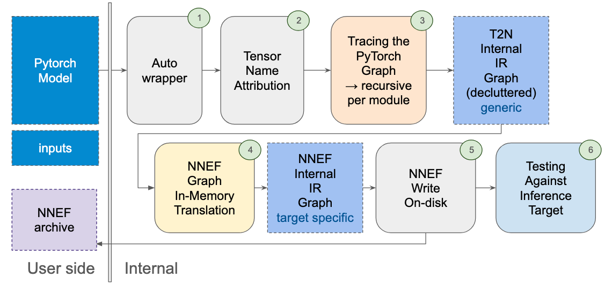

# :gear: Internal design

Internals of torch to NNEF export
is mostly segmented in 6 steps as shown bellow:

<figure markdown="span">
    
    <figcaption>figure 1: Export internal process</figcaption>
</figure>

Each of those steps have specific aims and goals.

1. Aims to make sense of complex inputs and outputs such as dict, dict like object containing tensors or tensors inside containers in containers...
2. Name each tensor after the module it is assigned to (if it's shared across multiple modules first name encountered will be retained)
3. Trace the PyTorch Graph module by module starting from the provided model each sub-module call is solved after this module have been traced. each submodule is colapsed inside it's parent. This tracing build a specific internal representation (IR) in torch to nnef which is NOT torch graph but a simplified version of it that is no more tied to torch cpp internals and with removed useless operators for inference.
4. Translate the torch to nnef internal IR into NNEF depending on inference target selected
5. Save each tensor on disk in .dat and serialize the graph.nnef and graph.quant associated.

<figure markdown="span">
    
    <figcaption>figure 2: code structure as of 2025-08 (n° correspond to figure 1)</figcaption>
</figure>

!!! note
    These steps only apply to `torch_to_nnef.export_model_to_nnef` export function that export the graph + the tensors.
    To observe those in practice setting log level to info and not filtering this lib logs is helpful a proposed default logger is available in `torch_to_nnef.log.init_log`

## 1. Auto wrapper

## 2. Tensor naming

## 3. Internal IR representation

While tracing the graph recursively you may debug it's parsed representation as follows:
let's imagine you set a breakpoint in `torch_to_nnef.torch_graph.ir_graph.TorchModuleIRGraph.parse` method you could call `self.tracer.torch_graph` to observe the
PyTorch representation:

```python
graph(%self.1 : __torch__.torchvision.models.alexnet.___torch_mangle_39.AlexNet,
      %x.1 : Float(1, 3, 224, 224, strides=[150528, 50176, 224, 1], requires_grad=0, device=cpu)):
  %classifier : __torch__.torch.nn.modules.container.___torch_mangle_38.Sequential = prim::GetAttr[name="classifier"](%self.1)
  %avgpool : __torch__.torch.nn.modules.pooling.___torch_mangle_30.AdaptiveAvgPool2d = prim::GetAttr[name="avgpool"](%self.1)
  %features : __torch__.torch.nn.modules.container.___torch_mangle_29.Sequential = prim::GetAttr[name="features"](%self.1)
  %394 : Tensor = prim::CallMethod[name="forward"](%features, %x.1)
  %395 : Tensor = prim::CallMethod[name="forward"](%avgpool, %394)
  %277 : int = prim::Constant[value=1]() # /Users/julien.balian/SONOS/src/torch-to-nnef/.venv/lib/python3.12/site-packages/torchvision/models/alexnet.py:50:0
  %278 : int = prim::Constant[value=-1]() # /Users/julien.balian/SONOS/src/torch-to-nnef/.venv/lib/python3.12/site-packages/torchvision/models/alexnet.py:50:0
  %input.19 : Float(1, 9216, strides=[9216, 1], requires_grad=0, device=cpu) = aten::flatten(%395, %277, %278) # /Users/julien.balian/SONOS/src/torch-to-nnef/.venv/lib/python3.12/site-packages/torchvision/models/alexnet.py:50:0
  %396 : Tensor = prim::CallMethod[name="forward"](%classifier, %input.19)
  return (%396)
```

`self.printall()` and observe the current torch to NNEF representation:

```
___________________________________[PyTorch JIT Graph '<class 'torchvision.models.alexnet.AlexNet'>']___________________________________
inputs: (AlexNet_x_1: torch.float32@[1, 3, 224, 224])

        Static Constants:
                int AlexNet_277 := 1
                int AlexNet_278 := -1

        Static Tensor:

        Blob TorchScript:

        List:

        TupleTensors:

        Directed Acyclic Graph:
                 None AlexNet_394 := prim::CallMethod<Sequential.forward>( AlexNet_x_1 )
                 None AlexNet_395 := prim::CallMethod<AdaptiveAvgPool2d.forward>( AlexNet_394 )
                 torch.float32 AlexNet_input_19 := aten::flatten( AlexNet_395, AlexNet_277, AlexNet_278 )
                 None AlexNet_396 := prim::CallMethod<Sequential.forward>( AlexNet_input_19 )

outputs: (AlexNet_396: None@None)
____________________________________________________________________________________________________
```

Since the process is recursive you can see this representation evolve as each submodule get parsed.

Also if you want to learn more the representation data structure we use you can look at the
[`torch_to_nnef.torch_graph.ir_data`](/reference/torch_to_nnef/torch_graph/ir_data/) and [`torch_to_nnef.torch_graph.ir_op`](/reference/torch_to_nnef/torch_graph/ir_op/).

## 4. NNEF translation

## 5. NNEF dump
